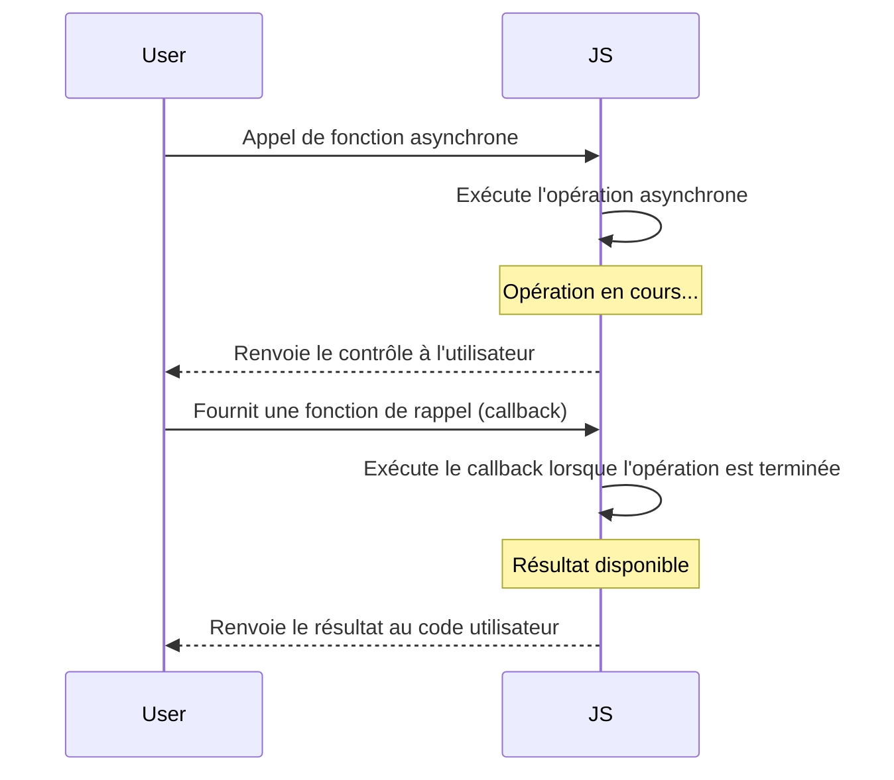

# Asynchrone

Ce schéma illustre comment une opération asynchrone en JavaScript fonctionne avec l'utilisation de callbacks pour gérer le résultat une fois que l'opération est terminée.



### 1. Introduction au JavaScript Asynchrone

En JavaScript, les opérations asynchrones sont des opérations qui permettent au code de continuer à s'exécuter pendant que ces opérations sont en cours, sans attendre leur achèvement. Cela est crucial dans le développement web pour améliorer l'expérience utilisateur, notamment lors de l'exécution de requêtes réseau, de la lecture de fichiers, ou d'autres opérations qui peuvent prendre du temps.

### Concepts Clés

- **Callback**: Une fonction passée en argument à une autre fonction qui sera exécutée une fois l'opération asynchrone terminée.
- **Promesses (Promises)**: Un objet représentant l'achèvement ou l'échec d'une opération asynchrone. Les promesses peuvent être chaînées pour une meilleure gestion des opérations asynchrones.
- **Async/Await**: Une syntaxe qui rend le travail avec des promesses plus confortable et plus lisible. `async` est utilisé pour déclarer une fonction asynchrone, et `await` est utilisé pour attendre la résolution d'une promesse à l'intérieur de cette fonction.

### 2. Exemples

#### Callbacks

```javascript
function fetchData(callback) {
  setTimeout(() => {
    callback("Données reçues");
  }, 1000);
}

fetchData((data) => {
  console.log(data); // Affiche "Données reçues" après 1 seconde
});
```

#### Promesses

```javascript
function fetchData() {
  return new Promise((resolve, reject) => {
    setTimeout(() => {
      resolve("Données reçues");
    }, 1000);
  });
}

fetchData().then(data => {
  console.log(data); // Affiche "Données reçues" après 1 seconde
});
```

#### Async/Await

```javascript
async function fetchAsyncData() {
  const data = await fetchData(); // fetchData retourne une promesse
  console.log(data); // Affiche "Données reçues" après que la promesse soit résolue
}

fetchAsyncData();
```

### 3. Exercices

#### Exercice 1: Utilisation de Callbacks
Ecrire une fonction `processData` qui prend un callback comme argument. Cette fonction doit utiliser `setTimeout` pour simuler une opération asynchrone qui prend 2 secondes, puis appelle le callback avec le résultat `"Données traitées"`.

#### Exercice 2: Conversion en Promesses
Convertir l'exercice précédent pour utiliser une promesse au lieu d'un callback.

#### Exercice 3: Utilisation d'Async/Await
Refaire l'exercice 2 en utilisant `async/await` pour gérer la promesse.

### Solutions

**Exercice 1:**

```javascript
function processData(callback) {
  setTimeout(() => {
    callback("Données traitées");
  }, 2000);
}

processData((result) => {
  console.log(result); // Doit afficher "Données traitées" après 2 secondes
});
```

**Exercice 2:**

```javascript
function processData() {
  return new Promise((resolve) => {
    setTimeout(() => {
      resolve("Données traitées");
    }, 2000);
  });
}

processData().then(result => {
  console.log(result); // Doit afficher "Données traitées" après 2 secondes
});
```

**Exercice 3:**

```javascript
async function processAsyncData() {
  const result = await processData(); // processData retourne une promesse
  console.log(result); // Doit afficher "Données traitées" après que la promesse soit résolue
}

processAsyncData();
```

Ces exercices devraient vous donner une bonne introduction au fonctionnement de l'asynchronisme en JavaScript. N'hésitez pas à expérimenter avec ces concepts et à les appliquer dans vos propres projets !