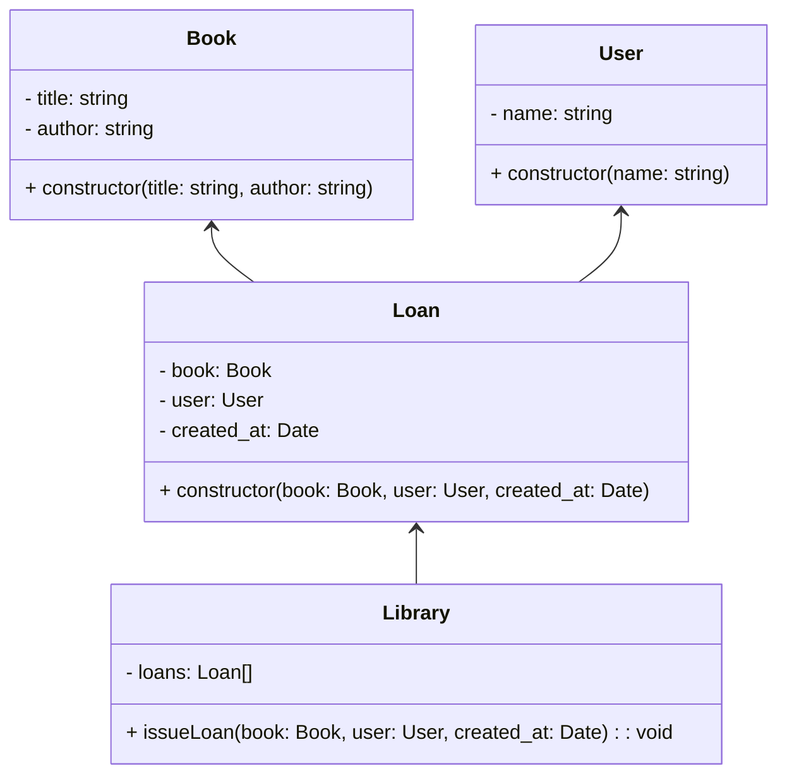

# Relations de classe

Dans la programmation orientée objet (POO), les relations entre classes jouent un rôle crucial dans la modélisation des interactions entre les différents éléments d'une application. 

> [!NOTE]
> Il existe plusieurs types de relations, chacune exprimant un aspect particulier des relations entre les classes.

## Association

L'association est la relation de base entre deux classes. Elle indique qu'il existe une relation entre les objets des classes concernées. Les associations peuvent être unidirectionnelles ou bidirectionnelles.

### Exercice association 

1. En étudiant les classes suivantes dites si cette relation vous semble unidirectionnelle ou bidrectionnelle ?

1. Encapsulez les données, les attributs sont publiques, ce principe n'est pas respecté ici, puis testez la logique des relations dans un fichier en créant des objets et en hydrant avec des données.

1. Créez un projet où deux classes sont dans la relation d'associativité et unidirectionnelle

```js
class Student {
  name: string;
  courses: Course[] = [];

  enroll(course: Course) {
    this.courses.push(course);
    course.students.push(this);
  }
}

class Course {
  name: string;
  students: Student[] = [];
}
```

## Composition 

C'est un principe de conception qui consiste à construire des objets complexes en les composant à partir d'objets plus simples. 

Plutôt que d'utiliser l'héritage pour créer des relations entre les classes, la composition utilise l'agrégation d'objets pour former une nouvelle entité.

>[!TIP]
> La composition est particulièrement utile lorsque les relations entre les objets ne sont pas clairement définies par une hiérarchie d'héritage, et lorsqu'il est nécessaire de construire des objets complexes avec des comportements spécifiques. 
> Elle favorise une conception plus souple et extensible.

### Exercice bibliothèque gestion

Implémentez les classes du diagramme UML suivant mettant en évidence la relation de composition.

Dans ce diagramme, Library utilise la composition pour intégrer des instances de Book, User, et Loan. Cela permet de construire un système de gestion de bibliothèque en utilisant des composants modulaires.



## Agrégation

L'agrégation est un type de relation entre des objets où un objet peut contenir d'autres objets, mais ces objets peuvent exister indépendamment de l'objet conteneur. 

Cela signifie que la durée de vie des objets contenus n'est pas nécessairement liée à la durée de vie de l'objet conteneur. En d'autres termes, les objets agrégés peuvent exister de manière autonome.

```js
class Engine {
  private _type: string;

  constructor(type: string) {
    this._type = type;
  }

  public type(): string {
    return this._type;
  }
}

class Car {
  private _model: string;
  private _engine: Engine;

  constructor(model: string, engine: Engine) {
    this._model = model;
    this._engine = engine;
  }

  public model(): string {
    return this._model;
  }

  public engine(): Engine {
    return this._engine;
  }
}

// Création d'une instance de moteur
const carEngine = new Engine('V6');

// Création d'une instance de voiture avec agrégation du moteur
const myCar = new Car('Sedan', carEngine);

// Accès aux informations sur la voiture et son moteur
console.log(`Modèle de la voiture: ${myCar.getModel()}`);
console.log(`Type de moteur: ${myCar.getEngine().getType()}`);
```