# TP Création d'une application avec Corrections et Ajouts d'Illustrations

Name : 🚀 **gamepastry**

## Introduction
Dans le cadre de ce TP, nous allons créer une application de jeu permettant de gagner des pâtisseries. L'application comportera deux pages : une pour jouer et une autre pour afficher les résultats.

Pour la partie graphique vous libre d'utiliser un framework CSS de votre choix.

## Page de Jeu

🚀 Sur la page principale, les utilisateurs peuvent lancer cinq dés. S'ils obtiennent une combinaison gagnante, ils remportent des pâtisseries en fonction de la combinaison. Voici les combinaisons gagnantes :

- **Un Yams :** Gagne 4 pâtisseries.
- **Un Carré :** Gagne 3 pâtisseries.
- **La grande suite :** Gagne 1 pâtisserie.

1. 🐊 Créez le test qui testera le service pour le jeu.

## Partie Facultative

Pour jouer, les utilisateurs doivent s'inscrire au préalable. De plus, chaque joueur peut lancer les cinq dés jusqu'à trois fois de suite.

## 🥟 Contraintes sur les Données

Nous utiliserons deux entités principales : `User` et `Pastry`.

### `User` Entity
- **Champs :**
  - id (int, clé primaire)
  - username (varchar(100), non nul)
  - email (varchar(100), non nul)
  - score (smallint, facultatif)

### `Pastry` Entity
- **Champs :**
  - id (int, clé primaire)
  - name (varchar(100), non nul)
  - origin (json, facultatif)
  - calory (smallint, facultatif)
  - price (double, facultatif)
  - image (varchar(100), facultatif)
  - quantity (smallint, facultatif)

🚀 Ces entités permettront de stocker les informations nécessaires sur les utilisateurs et les pâtisseries dans notre application de jeu. Libre à vous de créer d'autres entités et relations.

## Diagramme du jeu  

```mermaid
graph TD
  subgraph Application
    subgraph PageJeu
      Jeu((Jeu))
      Des{{Lancer 5 dés}}
      Yams((Un Yams<br/>Gagne 4 pâtisseries))
      Carre((Un Carré<br/>Gagne 3 pâtisseries))
      Suite((La grande suite<br/>Gagne 1 pâtisserie))
      Jeu -->|Obtient combinaison| Yams
      Jeu -->|Obtient combinaison| Carre
      Jeu -->|Obtient combinaison| Suite
      Des -->|Action utilisateur| Jeu
    end

    subgraph PartieFacultative
      Inscription((S'inscrire au préalable))
      LancerDes{{Lancer les 5 dés jusqu'à 3 fois}}
      Jeu -->|Condition d'accès| Inscription
      Jeu -->|Condition de lancer| LancerDes
    end

    subgraph ContraintesDonnees
      User[User]
      Pastry[Pastry]
      User -.->|Stocke| Jeu
      Pastry -.->|Stocke| Jeu
    end
  end
```

