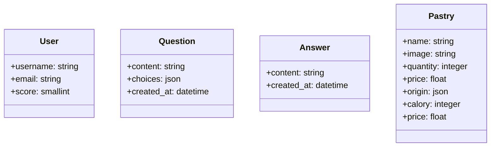
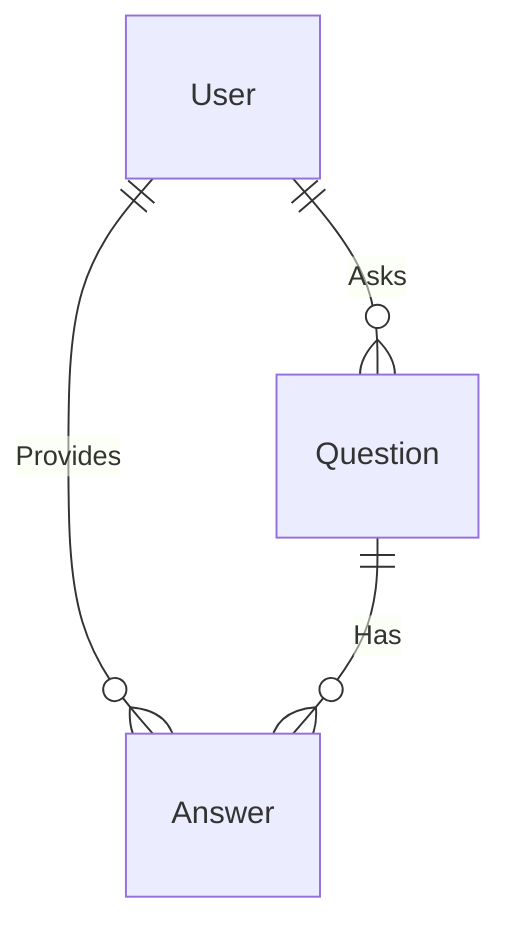

# ORM Symfony Repository DQL

## Projet QMC Pastry

1. :rocket: nous allons découvrir un peu mieux les fixtures, les repositories et  découvrir les services (introduction).

1. :rocket: Dans un deuxième temps nous ferons des révisions sur les relations. 

1. :rocket: Et enfin nous verrons un peu plus de Twig.

## :rocket: Fixtures

1. Installation dans le projet yams ( révision ) SF.

```bash
composer create-project symfony/skeleton:"7.0.*" yams
```

2. Créez une base de données yams dans MySQL.

```bash
composer require --dev doctrine/doctrine-fixtures-bundle
# symfony composer req orm-fixtures --dev

# Création d'une Fixture PastryFixtures insertion de données d'exemple
php bin/console make:fixtures PastryFixtures

php bin/console doctrine:fixtures:load
```

## Création des entités

- `User` (username : string, email : string, score: smallint)
  
```txt
+----------+--------------+------+-----+---------+----------------+
| Field    | Type         | Null | Key | Default | Extra          |
+----------+--------------+------+-----+---------+----------------+
| id       | int          | NO   | PRI | NULL    | auto_increment |
| username | varchar(100) | NO   |     | NULL    |                |
| email    | varchar(100) | NO   |     | NULL    |                |
| score    | smallint     | YES  |     | NULL    |                |
+----------+--------------+------+-----+---------+----------------+
```

- `Question`(content : string, choices : json, created_at : datetime)
  
```txt
+------------+----------+------+-----+---------+----------------+
| Field      | Type     | Null | Key | Default | Extra          |
+------------+----------+------+-----+---------+----------------+
| id         | int      | NO   | PRI | NULL    | auto_increment |
| user_id    | int      | YES  | MUL | NULL    |                |
| content    | longtext | NO   |     | NULL    |                |
| created_at | datetime | YES  |     | NULL    |                |
| choices    | json     | NO   |     | NULL    |                |
+------------+----------+------+-----+---------+----------------+

```
- `Answer`(content : string , created_at : datetime)

```txt
+------------+----------+------+-----+---------+----------------+
| Field      | Type     | Null | Key | Default | Extra          |
+------------+----------+------+-----+---------+----------------+
| id         | int      | NO   | PRI | NULL    | auto_increment |
| user_id    | int      | YES  | MUL | NULL    |                |
| content    | longtext | NO   |     | NULL    |                |
| created_at | datetime | NO   |     | NULL    |                |
+------------+----------+------+-----+---------+----------------+
```  

- `Pastry`(name : string, origin : json, calory  :json, price)
  
```txt

+---------+--------------+------+-----+---------+----------------+
| Field   | Type         | Null | Key | Default | Extra          |
+---------+--------------+------+-----+---------+----------------+
| id      | int          | NO   | PRI | NULL    | auto_increment |
| name    | varchar(100) | NO   |     | NULL    |                |
| origin  | json         | YES  |     | NULL    |                |
| calory  | smallint     | YES  |     | NULL    |                |
| price   | double       | YES  |     | NULL    |                |
| image   | varchar(100) | YES  |     | NULL    |                |
| qantity | smallint     | YES  |     | NULL    |                |
+---------+--------------+------+-----+---------+----------------+
```

- 🥟 Schéma des relations diagramme.



## Création des fixtures 

```php

namespace App\DataFixtures;

use App\Entity\Answer;
use App\Entity\Question;
use App\Entity\User;
use Doctrine\Bundle\FixturesBundle\Fixture;
use Doctrine\Persistence\ObjectManager;

class PastryFixtures extends Fixture
{
    public function load(ObjectManager $manager)
    {
        $pastry = new Pastry(); 
        // TODO ...
        $manager->persist($pastry);
        $manager->flush();
    }
}
```

## Partie 1 : Pastry 🍰

1. Hydratez la table pastry à l'aide de l'ORM avec les données d'exemple ci-dessous.

```php
return [
    [
        "name" => "Fondant suprême",
        "image" => "http://placehold.it/32x32",
        "quantity" => 4,
        "origin" => [
            "country" => "France",
            "region" => "Île-de-France",
        ],
        "calory" => 300,
        "price" => 5.5,
    ],
    [
        "name" => "Cake tout Chocolat",
        "image" => "http://placehold.it/32x32",
        "quantity" => 3,
        "origin" => [
            "country" => "Belgium",
            "region" => "Brussels",
        ],
        "calory" => 300,
        "price" => 7.5,
    ],
    [
        "name" => "Cake Framboise chocolat",
        "image" => "http://placehold.it/32x32",
        "quantity" => 4,
        "origin" => [
            "country" => "France",
            "region" => "Provence-Alpes-Côte d'Azur",
        ],
        "calory" => 300,
        "price" => 6.5,
    ],
    [
        "name" => "Brioche sucrée avec chocolat",
        "image" => "http://placehold.it/32x32",
        "quantity" => 3,
        "origin" => [
            "country" => "France",
            "region" => "Normandy",
        ],
        "calory" => 300,
        "price" => 4.5,
    ],
    [
        "name" => "Cake glacé fondant au chocolat",
        "image" => "http://placehold.it/32x32",
        "quantity" => 2,
        "origin" => [
            "country" => "Switzerland",
            "region" => "Zurich",
        ],
        "calory" => 380,
        "price" => 8.5,
    ],
    [
        "name" => "Éclairs au chocolat",
        "image" => "http://placehold.it/32x32",
        "quantity" => 5,
        "origin" => [
            "country" => "France",
            "region" => "Centre-Val de Loire",
        ],
        "calory" => 300,
        "price" => 3.5,
    ],
    [
        "name" => "Tarte poire chocolat",
        "image" => "http://placehold.it/32x32",
        "quantity" => 5,
        "origin" => [
            "country" => "France",
            "region" => "Brittany",
        ],
        "calory" => 380,
        "price" => 9.5,
    ],
    [
        "name" => "Banana au chocolat",
        "image" => "http://placehold.it/32x32",
        "quantity" => 3,
        "origin" => [
            "country" => "United States",
            "region" => "California",
        ],
        "calory" => 300,
        "price" => 5.0,
    ],
];
        
```

1. Créez une requête personnalisée (repository) pour faire la somme des prix. 
   
>[!NOTE] Pour chaque entité créée, Doctrine crée un repository (dossier Repositroy), par exemple Pastry et PastryRepository.

🐊 Dans le repository PastryRepository ajoutez la méthode suivante et commentez ce quelle fait concrètement.


```php
// ...
class PastryRepository extends ServiceEntityRepository
{
    // ...
    public function sumAllPrices()
    {
        // p représente quoi ?
        return $this->createQueryBuilder('p')
            ->select('SUM(p.price) as totalSum')
            ->getQuery()
            ->getSingleScalarResult();
    }
}
```

1. Créez le repository findAllOrderedByName, elle ordonne les pâtiserries par ordre croissant.

1. Créez une requête permettant de récupérer les calories de chaque pâtisserie ne dépassant pas une certaine valeur strictement.
   
```php
    $repository->findPastryWithCaloriesGreaterThan();
```

## Introduction à la notion de service

1. Créez le service MessageGenerator en TDD (test driven developpement), une simple classe, qui génère un message aléatoire. Une classe avec une méthode qui retourne un message aléatoire. Injectez simplement cette classe dans un contrôleur MessageController et affichez le message dans la page Web en JSON.

:pill: Avant de créez un service, vous pouvez inspecter le container de service à l'aide de la commande suivante :

```bash
php bin/console debug:autowiring
```

> [!NOTE] Les services sont automatiquements injectés dans les méthodes des contrôleurs.

1. Testez maintenant l'ensemble des questions précédentes dans deux services MessageGeneratorService et PastryService.

:rocket: Configuration préalable pour les tests à faire pour les questions précédentes.

:shell:

```bash
# Package de tests pour SF
composer require --dev symfony/test-pack

# Lancer les tests
php bin/phpunit
```

:rocket: Dans le fichier doctrime.yaml il faut faire pour SF ne suffixe pas par défaut le nom de la base de données.

```yaml
when@test:
    doctrine:
        dbal:
            # "TEST_TOKEN" is typically set by ParaTest
            # dbname_suffix: '_test%env(default::TEST_TOKEN)%'
```

1. Commentez le test suivant puis passez à l'implémentation du service lui-même, TDD.
   
```php

namespace App\Tests;

use App\Service\MessageGenerator;
use PHPUnit\Framework\TestCase;

class MessageGeneratorTest extends TestCase
{
    private MessageGenerator $generator;
    private array $messages;
    protected function setUp(): void
    {
        // quelque chose avant
        $this->generator = new MessageGenerator();

        $this->messages =  [
            'You did it! You updated the system! Amazing!',
            'That was one of the coolest updates I\'ve seen all day!',
            'Great work! Keep going!',
        ];
    }

    public function testMessage(): void
    {
        $message = $this->generator->getHappyMessage();

        $this->assertContains($message, $this->messages);
    }

    protected function tearDown(): void
    {
        parent::tearDown();

        // quelque chose après

    }
}
```

1. :pill: Créez une méthode dans le repository de l'entité Pastry **incrPastryCaloryTotalById** permettant d'augmenter d'un certain pourcentage les calaories d'une pâtisserie. Essayez de tester cette méthode. 

1. Création d'une fonction DQL pour la méthode ROUND de MySQL.
   
1. :pill: (Facultatif ) En SQL que fait la requête suivante ? Pouvez-vous facilement l'implémenter en DQL ?
   
```sql
SELECT p.origin FROM pastry as p WHERE JSON_EXTRACT(p.origin, '$.country') = 'France' ;
```
## Partie 2 : Question / réponses et User TP à faire en binôme.

Dans la suite du TP on ne vous demande pas de créez des pages pour l'instant, il faut créer les entités et hydrater vos données.

Application de questions `Pastry` sur la conception de pâtisseries.

- Schéma des données User, Answer et Question



:rocket: les données :

- Un utilisateur (`User`) peut poser plusieurs questions (`Question`), mais chaque question est posée par un seul utilisateur.
  
- Un utilisateur peut également fournir plusieurs réponses (`Answer`), et chaque réponse est fournie par un seul utilisateur.
  
- Une question peut avoir plusieurs réponses, et chaque réponse peut être associée à plusieurs questions, ce qui représente une relation Many-to-Many entre `Question` et `Answer`.

## Hydratation

1. Implémentez ces relations dans un nouveau projet SF, utilisez MySQL.
   
1. Hydratez chacune des entités  

1. Créez 3 (Alan, Alice et Bob) utilisateurs (utiliser les données ci-dessous).

1. Ajoutez des questions (utiliser les données ci-dessous).
   ```php 
    [
            [
                'question' => "What's your favorite type of pastry and why?",
                'choices' => ['Croissant', 'Chocolate Éclair', 'Fruit Tart'],
            ],
            [
                'question' => 'Can you recommend a bakery that makes amazing croissants?',
                'choices' => ['Bakery A', 'Bakery B', 'Bakery C'],
            ],
            [
                'question' => 'How do you like your éclairs—chocolate or coffee-flavored?',
                'choices' => ['Chocolate', 'Coffee', 'Both'],
            ],
            [
                'question' => 'Have you ever tried baking your own pastries at home? Any tips to share?',
                'choices' => ['Yes', 'No'],
            ],
            [
                'question' => 'Do you prefer sweet or savory pastries for breakfast?',
                'choices' => ['Sweet', 'Savory', 'Both'],
            ],
            [
                'question' => "What's the most unique pastry you've ever tasted?",
                'choices' => ['Cronut', 'Matcha Mille-Feuille', 'Saffron Pistachio Baklava'],
            ],
            [
                'question' => 'If you had to choose between a classic French macaron and a traditional American cupcake, which one would you go for?',
                'choices' => ['Macaron', 'Cupcake'],
            ],
            [
                'question' => 'Are there any pastries from a specific region or country that you\'d love to try?',
                'choices' => ['French Croissant', 'Italian Cannoli', 'Japanese Wagashi'],
            ],
            [
                'question' => "What's your go-to pastry to satisfy a sweet craving?",
                'choices' => ['Chocolate Cake', 'Lemon Tart', 'Almond Croissant'],
            ],
            [
                'question' => 'Do you enjoy experimenting with different pastry flavors, or do you stick to your favorites?',
                'choices' => ['Enjoy experimenting', 'Stick to favorites'],
            ],
        ];

   ``` 

1. Chaque utilisateur pose une/des question(s), associez des questions aux utilisateurs.
   
1. Tous les utilisateurs répondent aux questions, créez correctement leurs réponses et implémentez leur enregistrement.

## Repository (requêtes personnalisées)

1. Affichez tous les utilisateurs qui on répondu à au moins une question.